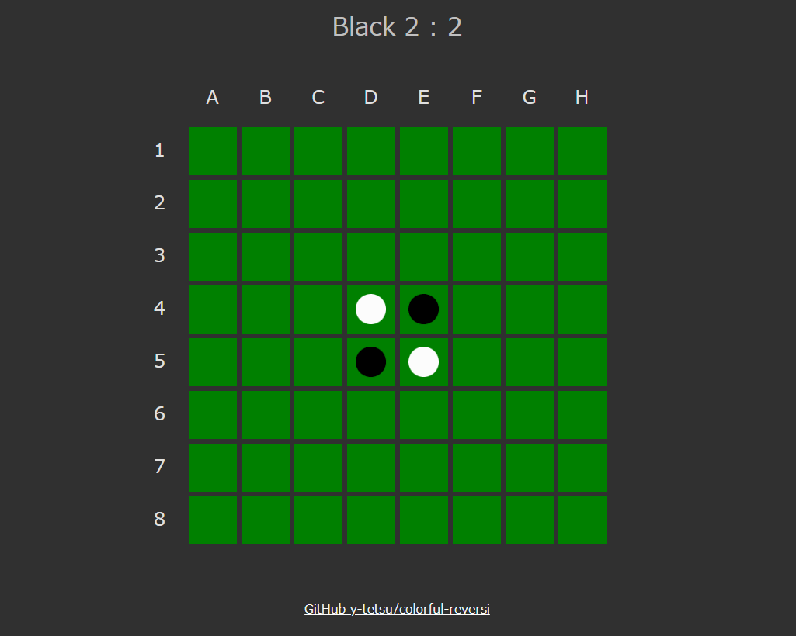

# colorful-reversi
JavaScriptで作る変則リバーシ

https://y-tetsu.github.io/colorful-reversi/

普通のリバーシです。 
黒が人、白はコンピュータ(ランダム)です。 

## 実行方法
ソース一式をダウンロード後、index.htmlを任意のブラウザで開く。 

## リンク
### JavaScriptで作る変則リバーシ⓪
https://qiita.com/y-tetsu/items/59237213d544f14bbc9c
