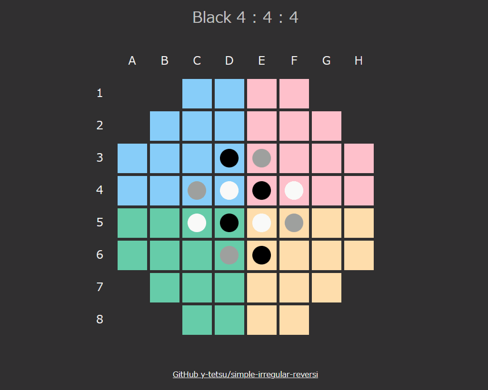

# colorful-reversi
JavaScriptで作る変則リバーシ

https://y-tetsu.github.io/colorful-reversi/

盤面の形や色、初期配置が異なる3人対戦の変則リバーシです。 

## プレイヤー
|色 |説明 |
|---|---|
|黒 |あなた |
|白 |コンピュータ(やや強い) |
|灰 |コンピュータ(ランダム) |

白を倒すことを目標にして下さい。灰色はお邪魔キャラです。

## 石
|色 |説明 |
|---|---|
|黒 |黒プレイヤーの石。挟むと相手の石を自分のものにできる。 |
|白 |白プレイヤーの石。(扱いは黒と同様) |
|灰 |灰プレイヤーの石。(扱いは黒と同様) |

## 実行方法
ソース一式をダウンロード後、index.htmlを任意のブラウザで開く。 

## リンク
### JavaScriptで作る変則リバーシ⓪
https://qiita.com/y-tetsu/items/59237213d544f14bbc9c
### JavaScriptで作る変則リバーシ①
https://qiita.com/y-tetsu/items/5ba5a5487534e47cc7ca
### JavaScriptで作る変則リバーシ②
https://qiita.com/y-tetsu/items/d1a5c7485cb34ae5c904
