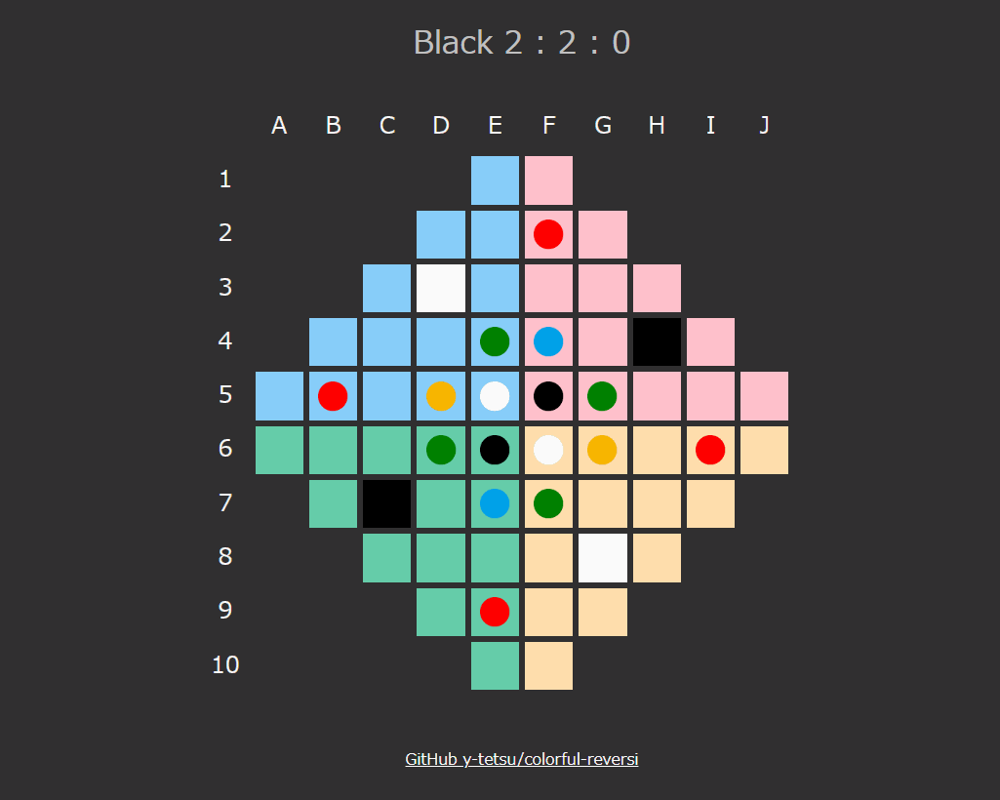

# colorful-reversi
JavaScriptで作る変則リバーシ

https://y-tetsu.github.io/colorful-reversi/

7色の石を使った、3(+2)人対戦で遊べる変則リバーシです。 
盤面の形や色、石の初期配置も通常とは異なっています。 

## プレイヤー
|色 |説明 |
|---|---|
|黒 |あなた |
|白 |コンピュータ(やや強い) |
|灰 |コンピュータ(ランダム) |
|シアン |コンピュータ(なるべく少なく石を取る、10手目に打つ) |
|山吹 |コンピュータ(なるべく多く石を取る、30手目と40手目に打つ) |

白を倒すことを目標にして下さい。灰・シアン・山吹はお邪魔キャラです。

## 石
|色 |説明 |
|---|---|
|黒 |黒プレイヤーの石。相手の石を挟むと自分のものにできる。 |
|白 |白プレイヤーの石。(扱いは黒と同様) |
|灰 |灰プレイヤーの石。(扱いは黒と同様) |
|緑 |プレイヤーなし。手番のプレイヤーが一番石を多く取れる色として扱われる。また、この石はひっくり返されない。 |
|シアン |シアンプレイヤーの石。相手の石を挟むと自分のものにできる。また、この石はひっくり返されない。 |
|山吹 |山吹プレイヤーの石。(扱いはシアンと同様) |
|赤 |プレイヤーなし。この石が挟まれると、同時に挟まれた全ての石が挟んだ石もろとも消える。 |

## 実行方法
ソース一式をダウンロード後、index.htmlを任意のブラウザで開く。 

## リンク
### JavaScriptで作る変則リバーシ⓪
https://qiita.com/y-tetsu/items/59237213d544f14bbc9c
### JavaScriptで作る変則リバーシ①
https://qiita.com/y-tetsu/items/5ba5a5487534e47cc7ca
### JavaScriptで作る変則リバーシ②
https://qiita.com/y-tetsu/items/d1a5c7485cb34ae5c904
### JavaScriptで作る変則リバーシ③
https://qiita.com/y-tetsu/items/ab8d92969c3c1b20fc9c
### JavaScriptで作る変則リバーシ④
https://qiita.com/y-tetsu/items/6730c37cbb4ce3d3994b
### JavaScriptで作る変則リバーシ⑤
https://qiita.com/y-tetsu/items/173b79c8ea01583a0215
